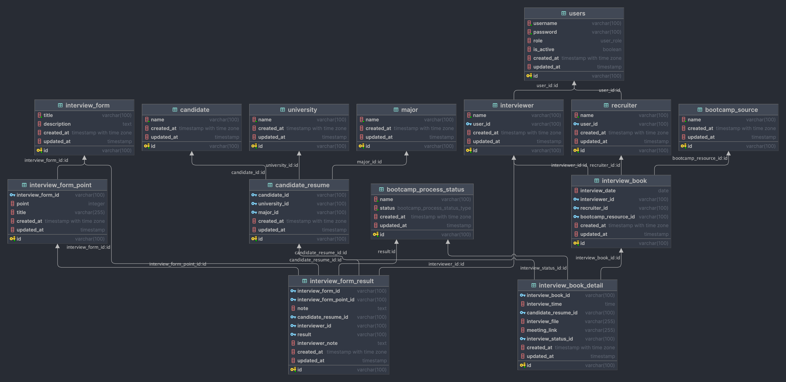

# Interview Bootcamp Apps

## ERD


## Init Database & Table

```bash
psql -U postgres -f resources/interview_bootcamp_apps.sql
```
## Detail Apps
1. Database PostgreSQL
2. Gin Gonic
3. Loggrus Loging File 
4. JWT
5. Email
6. Role (admin, recruiter, interviewer)